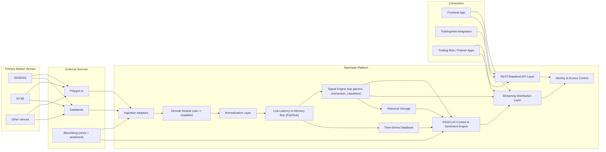

# Naixtrade High-Level Design

## 1) Purpose
Naixtrade is a real-time, low-latency (millisecond-class) market intelligence platform for multiple categories of market participants, including investors, scalpers, and day traders.

It ingests real-time market events, computes and classifies trading signals, and streams derived outputs to client applications through WebSockets, HTTP/3 (QUIC), and SSE.

It also exposes APIs for users who want to integrate precompiled real-time data into their own applications and trading bots, alongside REST APIs for authentication, stock metadata, and historical snapshots.

Naixtrade also includes an LLM/RAG capability that manages sentiment understanding and historical news context, and can stream contextual insights to users in real time.

## 2) Product Capabilities
- Real-time market data ingestion from multiple providers.
- Real-time processing and classification pipeline for trading signals.
- RAG/LLM-driven sentiment and historical news intelligence.
- Streaming delivery channels for low-latency consumers.
- Historical storage and retrieval for session-level analytics.
- Time-series data storage for analytics and sentiment processing workloads.
- API-first integration model for frontend apps, external platforms, and bots.
- Secure multi-user authentication and authorization.

## 3) Target Users and Use Cases
Primary user categories:
- Investors: monitor leadership, trend strength, and market context.
- Scalpers: consume ultra-low-latency event streams for short-duration entries/exits.
- Day traders: track top movers, momentum shifts, and news/sentiment catalysts.

Key use cases:
- Live market dashboard with ranked movers and momentum alerts.
- TradingView chart integration with real-time and historical bars.
- Bot ingestion of normalized real-time streams.
- Session-level historical analysis of signals and market behavior.

## 4) System Context

## 5) Logical Architecture
### 5.1 Ingestion Layer
- Dedicated adapters connect to each external provider.
- Each adapter transforms source-native payloads into a common internal event contract.
- Reconnect, retry, and backoff policies handle provider disconnects and transient errors.
- Market data providers (for example Polygon and Databento) aggregate and distribute venue data sourced from exchanges such as NASDAQ and NYSE.

### 5.2 Decode and Normalization Layer
- A decode module converts raw provider payloads into readable structured records.
- Converts heterogeneous upstream schemas into unified typed events.
- Applies timestamp normalization and source tagging.
- Performs deduplication and validation before events enter processing.

### 5.3 Low-Latency In-Memory Bus
- In-memory pub/sub is used as the hot path for minimal processing overhead.
- Multiple consumers can process the same event stream concurrently.
- Bounded channels/queues prevent unbounded memory growth.

### 5.4 Signal and Classification Engine
- Computes top gainers, momentum, and additional derived indicators.
- Enriches events with context and confidence/classification metadata.
- Produces standardized stream payloads for downstream subscribers.

### 5.5 RAG/LLM Sentiment and Context Engine
- Uses retrieval-augmented generation (RAG) over historical news and market context.
- Combines live events with time-series and historical corpora for contextual sentiment analysis.
- Produces user-facing sentiment/context streams and enriches signal payloads.
- Supports interactive, context-aware sentiment responses for subscribed users.

### 5.6 Distribution Layer
- Real-time delivery over:
  - WebSockets
  - HTTP/3 (QUIC)
  - SSE
- Supports authenticated subscriptions to stream categories such as:
  - `top_gainers`
  - `momentum`
  - `news`
  - `sentiment`
  - user-custom streams

### 5.7 API Layer
- REST APIs for:
  - authentication and user profile management
  - stock metadata and symbol details
  - historical signal retrieval
  - subscription lifecycle management
- TradingView-compatible datafeed endpoints for charting use cases.
- Integrator-facing APIs for external apps and trading bots.

### 5.8 Identity, Access, and Security
- Token-based authentication and per-request authorization.
- Stream access control by user, role, plan, and subscription entitlement.
- CORS allowlists and transport security at edge/load balancer.
- Secret management and key rotation for provider credentials.

### 5.9 Historical and Time-Series Storage
- Session snapshots and historical signal datasets stored for replay and analytics.
- Time-series database stores high-frequency event data used by sentiment processors and analytics pipelines.
- Query patterns include:
  - date-based retrieval
  - session-based retrieval
  - range-based retrieval
- Retention and archival policies tuned for analytics and compliance needs.

## 6) End-to-End Data Flow
1. Source adapters consume real-time feeds.
2. Decode module converts raw feed payloads into readable structured events.
3. Events are normalized into a unified contract.
4. Events are published to the in-memory bus.
5. Signal engine computes derived outputs and classifications.
6. High-frequency events are persisted into time-series storage.
7. RAG/LLM layer retrieves historical/news context and generates sentiment/context enrichments.
8. Distribution layer pushes updates to subscribed clients in real time.
9. Historical writer persists session snapshots and event aggregates.
10. REST/datafeed APIs serve pull-based consumers and chart integrations.

## 7) Interface Model
Streaming interfaces:
- WebSocket for full-duplex, stateful subscriptions.
- HTTP/3 streaming for low-latency transport scenarios.
- SSE for simple one-way event delivery.
- Sentiment/context streams generated by the RAG/LLM layer.

REST interfaces:
- Auth and user endpoints.
- Symbol and metadata endpoints.
- History and analytics endpoints.
- Datafeed endpoints for charting libraries and bot integrations.

## 8) Performance and Reliability Requirements
Latency goals:
- Millisecond-class internal processing path for hot streams.
- Near-real-time fanout to subscribed clients.

Availability goals:
- High availability for ingestion and distribution paths during market hours.
- Graceful degradation on individual provider issues.

Reliability controls:
- Upstream reconnect/backoff policies.
- Heartbeats and connection liveness checks.
- Backpressure protection on in-memory channels.
- Idempotent processing where possible for replay/recovery.

## 9) Scalability Strategy
- Horizontal scale of stateless API and stream gateway nodes.
- Partitioning by symbol universe, stream category, or user segment.
- Independent scaling of ingestion, processing, and distribution components.
- Load balancer routing for HTTP/3 and WebSocket traffic.

## 10) Observability and Operations
Telemetry:
- Ingest throughput by provider.
- Processing latency percentiles.
- Broadcast fanout counts and drop rates.
- RAG retrieval latency and LLM inference latency.
- Time-series write/read latency and retention health.
- Client connection and subscription metrics.
- Error budgets and alerting by subsystem.

Operational controls:
- Structured logging and correlation IDs.
- Health checks and readiness probes.
- Incident runbooks for provider outages and latency spikes.

## 11) Data Governance and Risk
Key risks:
- Heterogeneous provider schemas and timing semantics.
- Ordering/deduplication challenges across concurrent feeds.
- Rate limits and upstream outages during high volatility.
- Stream explosion from user-custom subscription growth.

Mitigations:
- Strict normalized event schema versioning.
- Provider fallback and circuit-breaker patterns.
- Quotas/rate controls for custom stream definitions.
- Continuous contract testing for downstream API compatibility.

## 12) Delivery Roadmap (High-Level)
1. Stabilize core multi-protocol streaming and core signal set.
2. Expand news and sentiment classifiers with strict schema contracts.
3. Harden custom subscription lifecycle, quotas, and entitlement checks.
4. Optimize performance and observability for peak market conditions.

## 13) Summary
Naixtrade is designed as a millisecond-class, real-time market intelligence platform for investors, scalpers, and day traders.  
Its architecture centers on multi-source ingestion, in-memory low-latency processing, real-time multi-protocol distribution, and API-first integration for frontends, TradingView, and trading bots.
